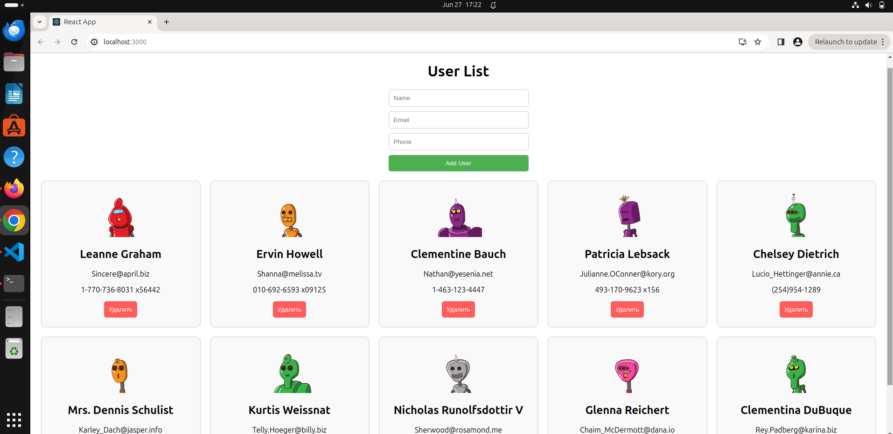
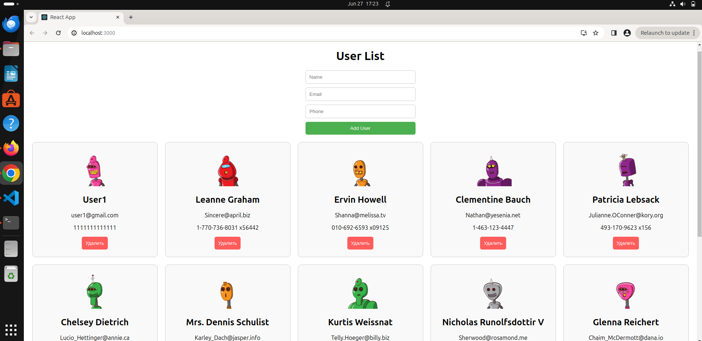
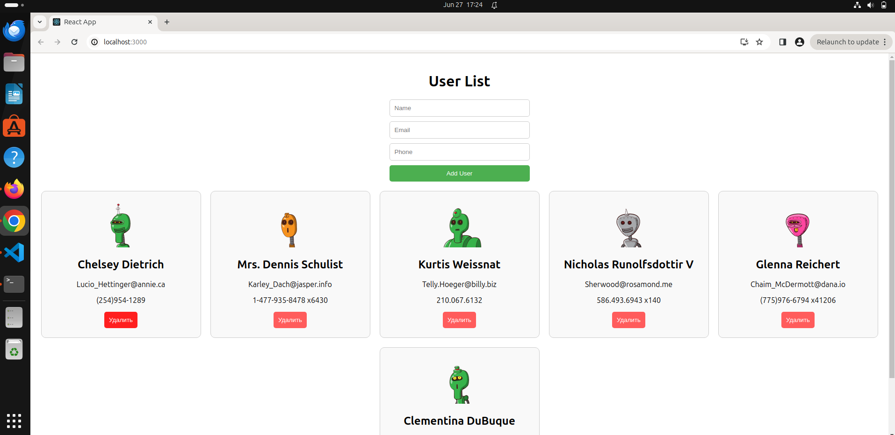

## Описание
Этот проект представляет собой React приложение для отображения списка пользователей, полученных из API. Приложение позволяет добавлять новых пользователей через форму, а также удалять существующих пользователей из списка.

## Функциональность
- Отображение списка пользователей с фотографией, именем, адресом электронной почты и номером телефона.
- Добавление нового пользователя через форму.
- Удаление пользователя из списка по нажатию на кнопку "Удалить".
- Обработка ошибок при загрузке данных из API.
- Поддержка различных размеров экранов (адаптивный дизайн).

## Используемые технологии
- React
- Axios для выполнения запросов к API
- Styled-components для стилизации компонентов

## Структура проекта
- `src/`
  - `components/`
    - `UserCard.js`: Компонент для отображения карточки пользователя.
    - `AddUserForm.js`: Компонент для формы добавления нового пользователя.
  - `App.js`: Главный компонент приложения.
  - `index.js`: Точка входа в приложение.

## Демонстрация работы

### Главный экран

### Добавление пользователя в форме

### Добавленный пользователь в список

### Удаление первых 5 пользователей

